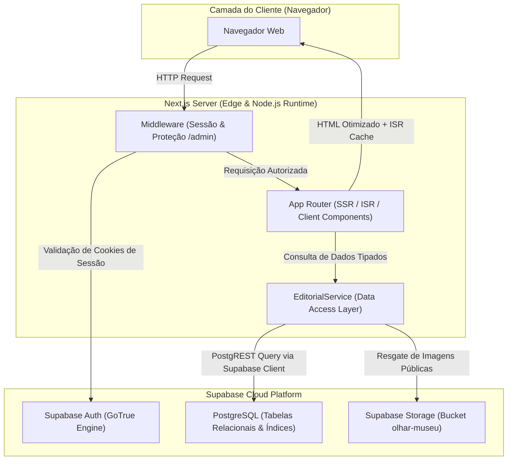
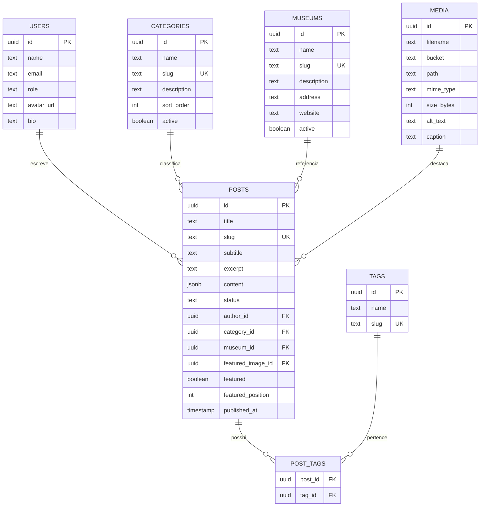

<div align="center">

# Olhar Museu (por SiMOP)
**Plataforma Editorial e Jornalística dos Museus e do Patrimônio Histórico de Ouro Preto**

[](https://nextjs.org/)
[](https://react.dev/)
[](https://www.typescriptlang.org/)
[](https://tailwindcss.com/)
[](https://supabase.com/)
[](https://nodejs.org/)
[](#licenca)

</div>

---

## Sumário

- [Sobre o Projeto](#sobre-o-projeto)
- [Funcionalidades](#funcionalidades)
- [Stack Tecnológica](#stack-tecnologica)
- [Arquitetura do Sistema](#arquitetura-do-sistema)
- [Estrutura do Projeto](#estrutura-do-projeto)
- [Fluxo de Dados e Execução](#fluxo-de-dados-e-execucao)
- [Modelo de Dados (PostgreSQL / Supabase)](#modelo-de-dados-postgresql--supabase)
- [Instalação e Execução Local](#instalacao-e-execucao-local)
- [Variáveis de Ambiente](#variaveis-de-ambiente)
- [Scripts Disponíveis](#scripts-disponiveis)
- [Build, Otimização e Deploy](#build-otimizacao-e-deploy)
- [Segurança e Conformidade](#seguranca-e-conformidade)
- [Decisões Técnicas de Engenharia](#decisoes-tecnicas-de-engenharia)
- [Desafios Técnicos Solucionados](#desafios-tecnicos-solucionados)
- [Status](#status)
- [Licença](#licenca)

---

## Sobre o Projeto

O **Olhar Museu** é uma plataforma editorial e sistema de gestão de conteúdo (CMS) desenvolvido sob medida para o ecossistema cultural de Ouro Preto (Minas Gerais), articulado junto ao SiMOP (Sistema de Museus de Ouro Preto).

### Propósito e Problema Resolvido
O município de Ouro Preto abriga um dos mais expressivos conjuntos museológicos da América Latina, com doze instituições ativas dispersas entre a sede histórica e distritos. No entanto, a difusão jornalística de pesquisas documentais, restauros, exposições temporárias e acervos sofria com a fragmentação de canais de comunicação e ausência de uma redação digital unificada.

A plataforma resolve essa lacuna oferecendo:
1. **Portal Público com Identidade Editorial Contemporânea**: Design inspirado na tradição tipográfica de periódicos culturais, garantindo legibilidade imersiva e performance estrita (Core Web Vitals).
2. **CMS Administrativo Especializado**: Fluxo completo de redação, revisão por pares, agendamento de pautas, categorização taxonômica e biblioteca de mídia conectada a bucket de armazenamento na nuvem.
3. **Indexação Institucional**: Cobertura integrada das 12 instituições museológicas cadastradas, conectando artigos a cada acervo específico.

---

## Funcionalidades

### Área Pública (Leitores)
- **Super Manchete e Destaques Editoriais**: Bloco de abertura com hierarquia visual precisa (lead de destaque e leituras secundárias).
- **Feed Cronológico com Paginação Dinâmica**: Acesso a reportagens com metadados de tempo de leitura, autor e data de publicação formatada em padrão pt-BR.
- **Cadernos e Editorias Segmentadas**: Navegação temática (Exposições, Patrimônio & Restauro, Arte Sacra, Memória e Sociedade).
- **Diretório dos Museus de Ouro Preto**: Hub institucional contendo ficha técnica, localização, endereço e catálogo de matérias vinculadas a cada museu.
- **Motor de Busca e Filtros**: Filtros combinados por categoria, museu, tag e busca textual em tempo real.
- **Página de Artigo Imersiva (Long-read)**: Tipografia otimizada para leitura contínua, suporte a capitulares (*drop caps*), citações destacadas (*pull quotes*), blocos de imagens anotadas e perfil do autor.

### Área Administrativa (Redação e CMS)
- **Autenticação Segura via Supabase SSR**: Gestão de sessões persistentes baseadas em cookies criptografados, protegidas por Middleware do Next.js.
- **Controle de Acesso Baseado em Perfis (RBAC)**: Diferenciação entre funções de `ADMIN`, `EDITOR` e `JOURNALIST`.
- **Editor de Notícias**:
  - Ciclo de vida editorial com estados estritos: `DRAFT`, `REVIEW`, `SCHEDULED`, `PUBLISHED`, `ARCHIVED`.
  - Atribuição de posição de destaque na home (`featured_position`).
  - Campos de otimização de SEO (título canônico, meta descrição, slug customizado).
- **Biblioteca de Mídia Integrada**: Upload direto para o Supabase Storage com rastreamento de dimensões, tamanho de arquivo, texto alternativo (acessibilidade) e legenda.
- **Gerenciamento Taxonômico**: CRUD completo de Categorias, Museus e Tags.

---

## Stack Tecnológica

### Frontend & Aplicação
- **Framework**: Next.js 15.1 (App Router, Server Components e Client Components onde necessário)
- **Linguagem**: TypeScript 5.7 (Modo estrito ativado, tipagem estrita de contratos)
- **Biblioteca Base**: React 19
- **Estilização**: Tailwind CSS 3.4 com tokens customizados (paleta institucional: Ouro Colonial, Noite, Marfim e Pedra)
- **Tipografia**: Google Fonts otimizadas via Next/Font (`Playfair Display`, `Plus Jakarta Sans`, `JetBrains Mono`)
- **Ícones**: Lucide React
- **Utilitários de Estilo**: `clsx` e `tailwind-merge` via função utilitária `cn()`

### Backend, Dados & Autenticação
- **Backend as a Service (BaaS)**: Supabase
- **Banco de Dados**: PostgreSQL com PostgREST
- **Autenticação**: Supabase Auth (GoTrue) com gerenciamento de sessão SSR via `@supabase/ssr`
- **Armazenamento de Arquivos**: Supabase Storage (Bucket seguro com URLs públicas)
- **API Client**: `@supabase/supabase-js` com instâncias singleton no cliente e scoped no servidor

### Ferramental e Qualidade de Código
- **Linter**: ESLint 9 integrado com `eslint-config-next`
- **Processamento CSS**: PostCSS e Autoprefixer
- **Engine**: Node.js >= 20

---

## Arquitetura do Sistema

A aplicação adota a arquitetura de **Next.js App Router** desacoplada em camadas claras de apresentação, serviço e acesso a dados.



---

## Estrutura do Projeto

```text
olhar-museu-editorial/
├── public/                      # Assets estáticos servidos diretamente
│   ├── favicon.svg              # Ícone vetorial da publicação
│   └── images/                  # Logotipos e fotografias dos 12 museus
├── src/
│   ├── app/                     # Rotas e páginas (Next.js App Router)
│   │   ├── (public)/            # Rotas públicas do portal
│   │   │   ├── categoria/[slug] # Listagem por editoria
│   │   │   ├── museus/[slug]    # Ficha institucional do museu
│   │   │   ├── noticias/        # Arquivo geral de reportagens e busca
│   │   │   │   └── [slug]/      # Artigo completo com renderizador rico
│   │   │   ├── quem-somos/      # Manifesto editorial e conselho
│   │   │   └── tag/[slug]       # Agrupamento temático por tag
│   │   ├── admin/               # Painel CMS restrito
│   │   │   ├── categorias/      # Gestão de editorias
│   │   │   ├── login/           # Autenticação de redatores
│   │   │   ├── midia/           # Biblioteca e upload de arquivos
│   │   │   ├── museus/          # Gestão de instituições cadastradas
│   │   │   ├── noticias/        # Listagem, criação e edição de artigos
│   │   │   └── tags/            # Gestão de tags taxonômicas
│   │   ├── layout.tsx           # Layout raiz da aplicação
│   │   ├── not-found.tsx        # Página 404 editorial
│   │   └── page.tsx             # Home principal (Super manchete, feeds e blocos)
│   ├── components/              # Componentes reutilizáveis
│   │   ├── admin/               # Componentes de formulário e CMS
│   │   ├── editorial/           # Cards de notícia, feeds, blocos e busca
│   │   ├── layout/              # Header, Navbar, Footer, MobileNav
│   │   └── ui/                  # Primitivos de UI (Button, Badge, Breadcrumbs)
│   ├── data/                    # Dados de fallback e catálogo institucional
│   │   └── mockData.ts          # Resiliência de visualização sem conexão ativa
│   ├── lib/                     # Camada de lógica e serviços
│   │   ├── services/            # Serviços de negócio (EditorialService)
│   │   ├── supabaseClient.ts    # Instância padrão do cliente Supabase
│   │   └── utils.ts             # Funções utilitárias (formatação de datas, slugify)
│   ├── styles/                  # Estilos globais
│   │   └── globals.css          # Configurações Tailwind, fontes e regras editoriais
│   ├── types/                   # Definições de contratos TypeScript
│   │   └── editorial.ts         # Tipos das entidades do sistema
│   ├── utils/                   # Utilitários de infraestrutura
│   │   └── supabase/            # Clientes para browser, server e middleware SSR
│   └── middleware.ts            # Middleware Next.js para controle de sessão
├── .env.example                 # Modelo documentado de variáveis de ambiente
├── .gitignore                   # Regras de exclusão de artefatos e segredos
├── next.config.ts               # Configurações de compilação e cabeçalhos de segurança
├── package.json                 # Dependências e scripts do projeto
├── tailwind.config.ts           # Tema e paleta de cores customizadas
└── tsconfig.json                # Configuração estrita do compilador TypeScript
```

---

## Fluxo de Dados e Execução

### 1. Fluxo do Leitor (Público)
```text
Usuário acessa rota pública (ex: /noticias/museu-do-cha)
       |
Next.js avalia cache ISR (Incremental Static Regeneration: 60s)
       |
EditorialService executa query relacional ao PostgreSQL do Supabase
       |
Mapeamento e higienização dos registros crus para o contrato Post
       |
Renderização estática do Server Component com hidratação mínima
       |
Entrega rápida do HTML ao navegador
```

### 2. Fluxo do Redator (CMS / Admin)
```text
Redator tenta acessar /admin
       |
Middleware intercepts request -> verifica cookies criptografados via Supabase Auth
       |
[Se não autenticado] -> Redireciona para /admin/login?redirectTo=/admin
[Se autenticado]    -> Atualiza tokens de sessão e autoriza acesso
       |
Redator redige matéria e anexa imagem
       |
Upload de imagem transmitido ao Supabase Storage
       |
Registro persistido na tabela 'posts' com status e tags associadas
```

---

## Modelo de Dados (PostgreSQL / Supabase)

O esquema relacional é estruturado em torno das seguintes entidades fundamentais:



---

## Instalação e Execução Local

### Pré-requisitos
- Node.js 20.x ou superior instalado
- Gerenciador de pacotes npm, yarn ou pnpm
- Uma instância ativa no Supabase (ou credenciais de projeto)

### Passo a Passo

1. **Clonar o repositório:**
```bash
git clone https://github.com/rauanmartech/olhar-museu.git
cd olhar-museu
```

2. **Instalar as dependências do projeto:**
```bash
npm install
```

3. **Configurar as variáveis de ambiente:**
Copie o arquivo de exemplo e preencha com suas credenciais:
```bash
cp .env.example .env.local
```

4. **Iniciar o servidor de desenvolvimento:**
```bash
npm run dev
```

A aplicação estará acessível em `http://localhost:3001`.

---

## Variáveis de Ambiente

As variáveis necessárias para a execução do portal devem ser configuradas no arquivo `.env.local`:

| Variável | Descrição | Exemplo |
| :--- | :--- | :--- |
| `NEXT_PUBLIC_SUPABASE_URL` | URL base da API do projeto Supabase | `https://xxxx.supabase.co` |
| `NEXT_PUBLIC_SUPABASE_ANON_KEY` | Chave pública anônima (JWT) do Supabase | `eyJhbGciOi...` |
| `NEXT_PUBLIC_SUPABASE_PUBLISHABLE_KEY` | Chave alternativa publicável (compatibilidade) | `eyJhbGciOi...` |
| `NEXT_PUBLIC_SITE_URL` | URL canônica de produção para metadados e SEO | `https://olharmuseu.com.br` |

> **Aviso de Segurança**: Nunca faça commit de arquivos `.env` ou `.env.local` contendo credenciais ativas. O repositório já inclui regras rígidas no `.gitignore` para prevenir exposição inadvertida.

---

## Scripts Disponíveis

No arquivo `package.json`, estão configurados os seguintes comandos:

```bash
# Executa a aplicação em modo de desenvolvimento (porta 3001)
npm run dev

# Compila o projeto otimizado para produção e valida tipos estáticos
npm run build

# Inicia o servidor com o build de produção compilado
npm run start

# Executa a análise estática de código com o ESLint
npm run lint
```

---

## Build, Otimização e Deploy

A compilação de produção gera rotas estáticas pré-renderizadas combinadas com renderização dinâmica sob demanda:

```text
Route (app)                                 Tipo         Revalidação
┌ /                                         Static (ISR) 60s
├ /noticias                                 Static (ISR) 60s
├ /noticias/[slug]                          Dynamic      Sob demanda
├ /categoria/[slug]                         Dynamic      Sob demanda
├ /museus/[slug]                            Dynamic      Sob demanda
├ /admin/*                                  Dynamic      Privado / RBAC
```

### Otimizações Implementadas
- **Next.js Image Optimization**: Conversão automática de imagens para formatos modernos (`AVIF` e `WebP`) com lazy loading nativo.
- **Incremental Static Regeneration (ISR)**: Cache de 60 segundos na página principal para balancear frescor das notícias e carga zero no banco de dados.
- **Code Splitting**: Chunks de JavaScript isolados por rota, mantendo o first load JS compartilhado em aproximadamente ~103 kB.

---

## Segurança e Conformidade

O projeto foi auditado para mitigar riscos comuns do OWASP Top 10 e prevenir vulnerabilidades em repositórios públicos:

1. **Zero Segredos no Código**: Todas as chaves são lidas exclusivamente de `process.env`. O histórico do repositório foi higienizado e não contém tokens legados.
2. **Cabeçalhos HTTP de Proteção**: Injetados diretamente via `next.config.ts`:
   - `X-Frame-Options: SAMEORIGIN` (mitigação contra Clickjacking)
   - `X-Content-Type-Options: nosniff` (mitigação contra MIME-sniffing)
   - `Strict-Transport-Security` (imposição de tráfego estritamente HTTPS)
   - `Referrer-Policy: strict-origin-when-cross-origin`
   - `Permissions-Policy` (desativação preventiva de câmera, microfone e geolocalização)
   - `poweredByHeader: false` (eliminação do cabeçalho `X-Powered-By` para dificultar fingerprinting de tecnologia)
3. **Controle de Sessão em Cookies**: Sessões administrativas gerenciadas via cookies `HttpOnly`, `SameSite=Lax` manipulados pelo `@supabase/ssr`.

---

## Decisões Técnicas de Engenharia

1. **Por que Next.js 15 App Router?**
   Permite renderizar páginas públicas diretamente no servidor com SEO completo (geração de meta tags dinâmicas e OpenGraph sem ferramentas externas), ao mesmo tempo em que oferece uma experiência fluida de SPA na área administrativa.

2. **Por que PostgREST Relacional via Supabase em vez de ORMs pesados?**
   O cliente do Supabase permite consultas aninhadas com joins automáticos (`category!posts_category_id_fkey`, `author!posts_author_id_fkey`) com zero overhead de compilação de queries, mantendo o bundle leve e as respostas instantâneas.

3. **Arquitetura de Fallback Resiliente**:
   O `EditorialService` possui mecanismos de tratamento defensivo: se a conexão remota com o banco de dados falhar momentaneamente, o sistema não entra em colapso com página em branco; ele serve dados estruturados de contingência até o restabelecimento do serviço.

4. **Design Editorial Puro sem Frameworks Genéricos**:
   A interface foi desenvolvida sob medida em Tailwind CSS, utilizando grids modulares, fios de jornal finos (`divide-stone/40`) e contraste harmônico entre a serifa expressiva de `Playfair Display` para títulos e a legibilidade moderna de `Plus Jakarta Sans` para o corpo das matérias.

---

## Desafios Técnicos Solucionados

- **Conflito de Foreign Keys no PostgREST**:
  Implementação de aliasing explícito nas queries do Supabase para resolver ambiguidade entre chaves estrangeiras (`posts_author_id_fkey`, `posts_category_id_fkey`, `posts_museum_id_fkey`).
- **Harmonização Visual de Cards Secundários**:
  Eliminação de espaçamento vertical residual (`items-stretch` vs `items-start`) e remoção de bordas duplicadas na variante compacta de notícias, garantindo alinhamento tipográfico limpo em telas desktop e mobile.
- **Sincronização de Sessão SSR no Middleware**:
  Configuração precisa do ciclo de leitura e escrita de cookies entre o Edge Middleware e os Server Components utilizando as APIs recentes do `@supabase/ssr`.

---

## Status

**Produção / Pronto para Publicação**  
Aplicação testada, auditada, compilando perfeitamente e validada para deploy em produção.

---

## Licença

Este projeto é desenvolvido para o ecossistema cultural e museológico de Ouro Preto (SiMOP). Direitos reservados aos idealizadores e à equipe de desenvolvimento editorial.
